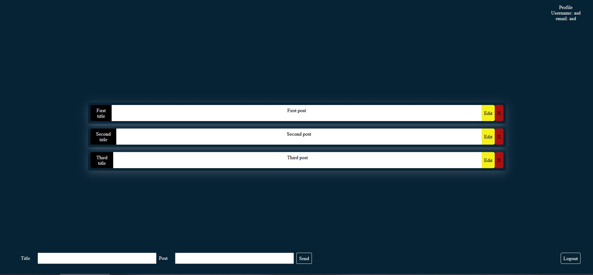
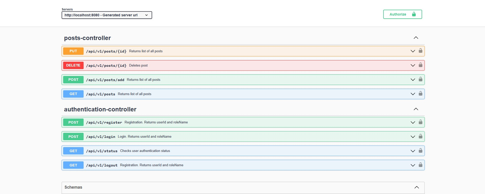
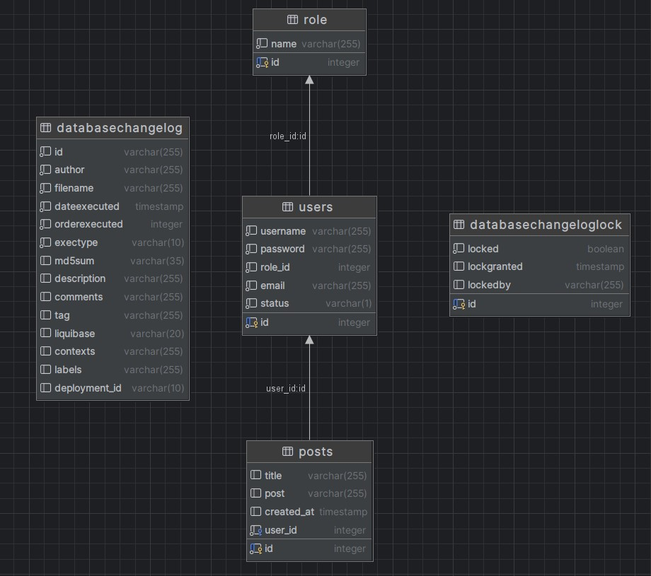

# Homework

## Project Description

### Tech Stack:

- **Frontend**: TypeScript React
- **Backend**: Java Spring-Boot
- **Database**: SQL Postgres

#### Prerequisites

- Java 21 installed
- Node.js and npm installed
- Docker

## How to run the project

Run the Postgres database via

```bash
docker run --name newsDB -e POSTGRES_DB=news -e POSTGRES_PASSWORD=randomPassword -p 5555:5432 -d postgres
```

Run the frontend with

```bash
cd frontend
npm install
npm run dev
```

Run the backend with

```bash
cd backend
gradlew bootRun
```

Database migration filling by Liquibase.
Api documentation by Swagger.

## Screenshots

Here's a screenshot of the project:






_Author: [Jaanus Saar](https://www.the-estonian.com)_